# SwissSonar 🐅

SwissSonar is an investment companion that lets you:

- 📈 Refresh and store cryptocurrency data  
- 🤖 Train predictive models on selected tickers  
- 👁️ Manage a personal investment board (crypto, stocks, forex) in **Streamlit**  
- ☁️ Run automated trainings in the background with **GitHub Actions**  

---

## 🚀 Features

- **Local Script Mode**
  - Refresh crypto coin data and save to database
  - Train machine learning models with custom tickers

- **Streamlit Dashboard**
  - Create & manage personal boards
  - Track multiple asset classes (crypto, stocks, forex)
  - Automatic price fetching from providers (CoinGecko, Yahoo Finance, …)
  - Real-time PnL (profit & loss) calculation per asset, per rubrick, and global total

- **Cloud Automation**
  - Queue training jobs by pushing `.txt` files in `jobs/`
  - GitHub Actions picks up jobs, runs training, and commits models back to the repo

---

## 📂 Usage

### 1. Local Script

Refresh all crypto coins and store them in the database:

```bash
python main.py --refresh-coins True
```

Train a model on selected tickers:

```bash
python main.py --train <MODEL_ID> --tickers "<coins>:<coins>:<coin>:..."
```

### 2. Streamlit Board

Run the dashboard:

```bash
streamlit run main.py
```

From there you can:
- Create boards (e.g. "My Portfolio")
- Add rubricks (crypto, stocks, forex)
- Add investments (buy price, quantity)
- Track live PnL

### 3. GitHub Actions (Cloud Training)

To schedule training:
- Create a file inside jobs/ named <anything>.txt
- File format:

```ruby
9
BTC:ETH:SOL
```

- Line 1 → Model ID
- Line 2 → Tickers list separated by :

When pushed to GitHub, Actions will:

1. Run training
2. Save the trained model
3. Commit the results back to the repo

## 🔑 Secrets Management
Secrets are required to connect to APIs and databases.

### Local (secret.json)
```json
{
  "client_id": "",
  "client_secret": "",
  "user_agent": "",
  "google_key": ""
}
```

### GitHub Actions (Repository → Settings → Secrets)
- CLIENT_ID
- CLIENT_SECRET
- USER_AGENT
- GOOGLE_KEY
- MONGO_URI
- DB_NAME

### Streamlit (secrets.toml)

```toml
client_id = ""
client_secret = ""
user_agent = ""
google_key = ""

[mongo]
uri = ""
db_name = ""

[github]
github_token = ""
repo_name = ""
```

### 📊 Data Providers
- Crypto → CoinGecko API
- Stocks → Yahoo Finance (TICKER.EXCHANGE, e.g. MC.PA, AAPL)
- Forex → Yahoo Finance Forex tickers (EURUSD=X, GBPJPY=X)

### 🖼️ Architecture

```mermaid
flowchart TD

    subgraph User
        A1[💻 Streamlit Dashboard]
    end

    subgraph GitHub["GitHub Repo"]
        G1[📂 jobs/ queue]
        G2[🤖 GitHub Actions Training]
        G3[📦 models.db + trained models]
    end

    subgraph Database
        D1[(🗄️ MongoDB)]
    end

    subgraph APIs
        P1[🌐 CoinGecko]
        P2[📊 Yahoo Finance Stocks/Forex]
    end

    A1 -- Manage board / track investments --> D1
    A1 -- Fetch prices --> P1
    A1 -- Fetch prices --> P2
    A1 -- Push jobs --> G1

    G1 --> G2
    G2 -- Train models --> G3
    G3 --> A1
    G2 --> D1
```



### 🛠️ Development
**Requirements**
- Python 3.10+
- Streamlit
- yfinance
- pytickersymbols
- pymongo
- PyYAML

### Install dependencies:

```bash
pip install -r requirements.txt
```

### 📌 Roadmap
 Expand stock/forex symbol preloading \
 Improve UI for investment tracking \
 Add notifications when thresholds are hit \
 Extend ML model types

### ⚖️ License
MIT License © 2025 SwissSonar

